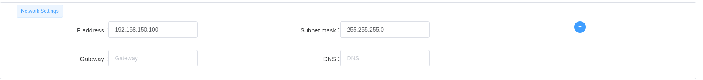
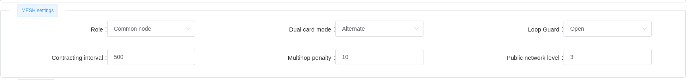

# LinkAV ROS1 package
_LinkAV module interface package for **Lynxdrone**._

Configurations: 
* ASUS-TUF-Dash-F15-FX516PM-FX516PM | Ubuntu 20.04 | ROS noetic
* IP mesg Radio Module 5G 1W, model LKAV-6310

## Overview
This packages implements network monitoring tools for point to point communication and mesh managing systems.
For now, it provides : 
- GS to single robot measurement tool
- Gs to multiples robots measurement tool
- Network identification tool
In next update, we project to add the following functionnalities:
- Mesh topologic map identification
- General mesh diagnostic management
- Mesh configuration tool

## LKAV6310 module
#### Hardware
The LKAV-6310 is a wireless mesh module works at 5GHz band. It supports data rate up to 96Mbps, is a lightweight module which suits the on-site video capture, lidar data communication and more.

| Specifications |  |
|--|--|
| Frequency | 5.180~5.825GHz (802.11AN) |
| Receiving Sensitivity | Max -97dBm |
| Interfaces | IPX *2 |
|  | LAN*2 |
|  | GPIO*1 |
|  | USB*2 |
|  | TTL*2 |
|  | DC*1 |
| Max Throughput | 96Mbps@40MHz |
| Modulation Type | BPSK/QPSK/16-QAM/64-QAM/256-QAM |
| Management | WEB |
| Nodes Number | No less than 64 nodes |
| Baud Rate | 1200bps~115200bps (Default 115200bps) |
| Encryption | AES256 |
| Power Input | 7V-24V DC |
| Power Consumption | Average 6W |
| Dimensions | 60x45x8mm (L x W x H) |
| Weight | 16g |
| Working Temp. | -40℃~ +65℃ |
| Storage Temp. | -45ºC ~ +85ºC |
| Working Humidity | 5% ~ 95% (Non-condensing) |

More about hardware spec in the [datasheet](doc/LKAV-6310.pdf).

#### Module setup
The LK6310 modules need to be configurated before use. This set up results in 3 main steps : 
- **IP addresse** : The default addresse of the module is 192.168.166.10. This addresse, and all parameters can be change via the WEB APi provided by the manufacturer. To connect to the WEB API, simply turn on the module (12V or 24V) and set your host computer wire connection to the same network (IPV4 : 192.168.166.X, mask : 255.255.255.0). Then open your internet browser and go to 192.168.166.10 : This will open to WEB API. 

Connect to the module and go to the **NETWORK** tab, then set the IP addresse as wanted : 

- **Mesh configuration** : To be part of a mesh, a module needs to be configurated. In the WEB API, go to the **NETWORK** tab, in the **MESH settings** container, and set the module as :

Then, go to the **Wireless** tab and set the **Virtual interface** as : 

- **Serial configuration**: LK6310 modules provide severals serial ports you can configurate to be used in your project. This functionnality can be set in the **Advanced** tab of the WEB API.

The package provides a SerialToTCP class you can use to communicate in a serial transparent transmission. More details [here](https://www.youtube.com/watch?v=BBJa32lCaaY).

## Install
#### Clone the project  

~~~bash 
  cd ~/catkin_ws/src
  git clone https://github.com/Lynxdrone/linkav_ros.git
~~~
(_Dependencies may be updated, need a installation check_)
#### Go to workspace and build 

~~~bash  
  cd ~/catkin_ws
  catkin_make
~~~

## How does it work
### General process  
The LinkAV are compatibles with the [Telnet protocol](https://www.ionos.fr/digitalguide/serveur/outils/telnet/). This gives your to possibility to establish a direct and bidirectionnal communication with any module in the network.

The basic routine to connect to any module is the following : 
- **Connect to the module with telnet** : `telnet module_ipv4 connection_port` . Example (_connection port is set to 9753 for all the LKAV6310 modules_) :

    ~~~bash 
      telnet 192.168.150.100 9753 
    ~~~
    Output : 
    ~~~bash 
    Trying 192.168.150.100...
    Connected to 192.168.150.100.
    Escape character is '^]'.
    
    console :
    ~~~
    Now you can use any telnet function. To exit, just write "exit".
- **Connect to the module interface** : To connect to the module interface, you need to log in with : `auth {"username":"username","password":"password"}`, which give you a secretkey. This secret key is requested by any command in order to be executed, so you need keep it. 

    Output : 
    ~~~bash 
    console : auth {"username":"admin","password":"admin"}
    {"secretkey":"bcfdf0de6fb46687c8180035c2e06613","errorcode":"0"}
    ~~~
- **Execute the command you need** : Once your connected and you know the secretkey, you can execute any command you want provided by the manufacturer. All command and detail are in [this PDF](/doc/json_command.pdf).

We use this routine in any code to communicate with a module.

### Telnet
Telnet is a basic code that connect to a module and extract its connectlist and its systeminfo. Those values are not used for now, this node is meant to be use by anyone as a starting point for a network monitor with the LKAV modules.

More documentation is needed to explore all the data extract from the connect list and the proper way to use it. **In progress...**

##### Node parameters
- `"host_ip", default="192.168.150.100"` : Host device ip to connect with. Best pratic is to set this value to the GS module.

### GS to Robot
Gs_to_robot provides a simple signal measurement functionnality.
The code connectes to a module and scan the mesh network. It gets the connectlist (with only one device) and extract the signal level (in dB). This signal level is then published.

The resulting signal level is given between -0dB to -94dB. We can considere a appropriate signal level from -0dB to -25dB. Considering our applications, a -70dB signal level is the lower limit we can accept.

##### Publised topic
* _/signal_ ([std_msgs/Float32](http://docs.ros.org/en/noetic/api/std_msgs/html/msg/Float32.html))

    Signal level in dB.

##### Node parameters
- `"host_ip", default="192.168.150.100"` : Host device ip to connect. Best pratic is to set this value to the GS module.
- `"robot_ip", default="192.168.150.101"` : Robot ip to evaluate connection with.
- `"mesh_config"` : Config file regrouping the mesh's devices name, IP and MAC addresses.
- `"pub_topic", default="/scorp/signal"` : Topic to publish the signal value.

### Mesh monitor
*In progress...*

